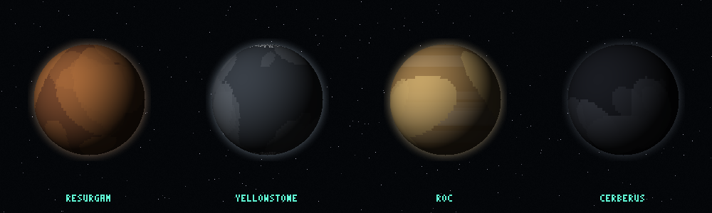

# Revelation Space Starmap — Books 1–2

An interactive 3D star map of the worlds of **Revelation Space**, the first novel in Alastair Reynolds' hard-SF space-opera series. Systems, planets, lighthugger routes, and the events of the book (2083–2567), rendered as a single self-contained HTML file.

## What it covers

This first version maps the core geography of *Revelation Space* (2000):

- **Epsilon Eridani / Yellowstone** — Chasm City and the Glitter Band, humanity's cultural capital, gutted by the Melding Plague.
- **Delta Pavonis / Resurgam** — the dust-blown desert world where Dan Sylveste excavates the 900,000-year-dead Amarantin.
- **Roc** — the system's gas giant.
- **Hades / Cerberus** — the neutron-star computer and the artificial Amarantin world hiding an Inhibitor beacon.
- The lighthugger **Nostalgia for Infinity**'s route from Yellowstone to Resurgam (2546–2566) and on to Cerberus (2567).

## Features

- 3D tactical starmap (Three.js) with glow-sprite stars, a light-year grid centred on Sol, projected labels, and a selection reticle.
- Timeline 2083–2567 with autoplay.
- Click any star or planet to fly to it; click planets to follow their orbit.
- Telemetry sidebar with lore, native biology (the Amarantin), hazards, and "Did you know?" facts.
- Search across systems, planets, and people.
- **VR mode** (WebXR) for Meta Quest: immersive view with a floating control panel and controller-ray selection.

## Controls

| Input | Action |
|---|---|
| Drag | Rotate |
| Right-drag / 2-finger | Pan |
| Scroll / pinch | Zoom |
| Click star or planet | Open telemetry + fly to |
| ENTER VR (top-right) | Immersive Quest mode |

## Running

Open `index.html`. No build step, no server (Three.js and GSAP load from cdnjs). For GitHub Pages: Settings → Pages → Deploy from branch → `main` / root.

## Attribution

- The Revelation Space series © Alastair Reynolds — this is an unaffiliated fan project.
- Lore and locations derived from the novel and the [Revelation Space Fandom Wiki](https://revelationspace.fandom.com) (CC BY-SA). Some coordinates are stylised where the books name no precise position.
- Engine and design adapted from a sibling Bobiverse starmap project.

Code: MIT (see LICENSE).
